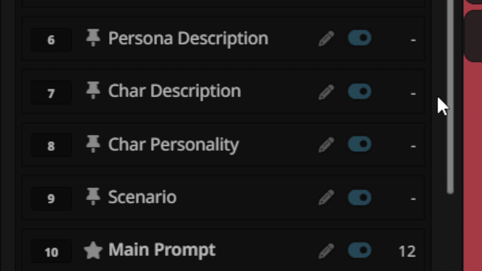

# Preset Prompt Reordering

SillyTavern extension to reorder prompt entries in Chat Completion presets by editing position numbers.

## Features
- Shows position number before each prompt entry
- Edit number to instantly move entry to new position
- Real-time DOM update (no page refresh needed)

## Installation
1. SillyTavern → Extensions → Install Extension
2. Paste: `https://github.com/Mroffza/SillyTavern-PresetPromptReordering`
3. Click Install

## Usage
Open Chat Completion preset → edit number on the left of any prompt entry → press Enter

# Demo

My english is not that good. Sorry if you guy don't understand but I use AI to write it for me.(And AI make this extension too)
